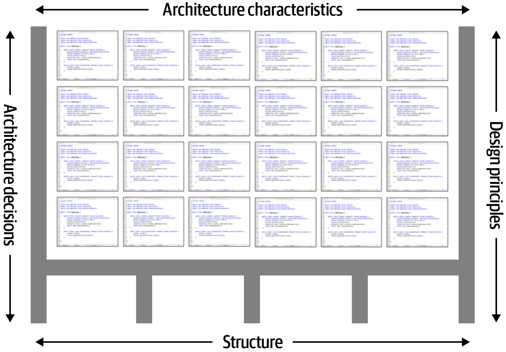
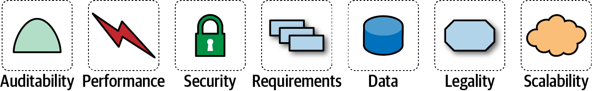

# 第1章 介绍
“软件架构师”这一职业在世界众多职业榜中名列前茅。然而，当读者看看清单上的其他工作(如护士或财务经理)，会发现他们都有一条比较清晰的职业路径。为什么软件架构师没有这样的路径？

首先，因为行业本身并没有很好地对软件架构进行定义。当我们教授基础课程时，学生们经常问软件架构师是干什么的简明定义，而我们又坚决拒绝给出这样的定义。我们不是唯一的受害者。众所周知，马丁·福勒在他著名的白皮书《谁需要架构师？》也拒绝给架构师下定义，他引用了那句名言：

> 架构是关于重要的东西…无论那是什么。
>
> 拉尔夫•约翰逊

往下看一下，我们创建了如图1-1所示的思维导图，虽然它不是很完整，但表明了软件架构的范围。事实上，我们很快就会给出软件架构的定义。

第二，正如思维导图中所示，软件架构师的角色包含了大量的职责和范围，并且还在不断扩大。十年前，软件架构师只处理纯技术方面的架构，如模块化、组件和模式。从那时起，由于新的架构风格利用了更广泛的功能（如微服务），软件架构师的角色得到了扩展。在“架构与…的交集”中，我们涵盖了架构的许多交叉点以及组织的其余部分。

图1-1 软件架构师的职责包括技术能力、软技能、操作意识以及其他许多方面

第三，由于软件开发生态的快速发展，软件架构是一个不断运动的目标。今天给出的任何定义在几年后都将过时，而且是不可救药的过时。维基百科对软件架构的定义给出了一个合理的概述，但是其中许多句子已经过时了，例如“软件架构是关于做出基本的结构选择，一旦实现，更改这些选择的代价是昂贵的。”然而，架构师设计的现代架构风格，如微服务，其理念是增量内建，在微服务中进行结构更改不再是昂贵的。当然，这种能力意味着与其他关注点(如耦合)的权衡。很多关于软件架构的书都把它看作一个静态的问题；一旦解决，我们可以放心地忽略它。然而，在本书中，我们认识到软件架构固有的动态特性，包括定义本身。

第四，很多关于软件架构的材料只与历史相关。维基百科的读者不会不注意到令人眼花缭乱的首字母缩略词和对整个知识宇宙的交叉引用。然而，这些首字母缩略词中有许多代表着过时或失败的尝试。即使是几年前完全有效的解决方案现在也可能不是行之有效，因为环境已经改变。软件架构的历史充满了架构师尝试过的东西，却只意识到破坏性的副作用。我们在这本书中讨论了其中的许多课程。

为什么现在能有一本关于软件架构基础的书？软件架构的范围并不是开发世界中不断变化的唯一部分。新技术、新技术、新能力……事实上，找到过去十年没有改变的东西比列出所有的变化要容易得多。软件架构师必须在这个不断变化的生态系统中做出决策。因为一切都在变化，包括我们做出决定的基础，架构师应该重新检查一些核心公理，这些公理在早期编写软件架构时是有用的。例如，早期关于软件架构的书籍没有考虑到DevOps的影响，因为在这些书写的时候DevOps还不存在。

在学习架构的时，读者必须记住，就像许多艺术一样，它只能在背景中理解。架构师所做的许多决策都是基于他们所处环境的现实情况。例如，20世纪后期架构的主要目标之一包括最有效地使用共享资源，因为当时所有的基础设施都是昂贵且商业化的：操作系统、应用程序服务器、数据库服务器等等。想象一下，走进一个2002年的数据中心，告诉运营主管：“嘿，我有一个堪称革命性架构风格的好想法，每个服务都运行在自己独立的机器上，拥有自己的专用数据库(这就是我们现在所说的微服务)。”所以，这意味着我需要50个Windows许可证，另外30个应用服务器许可证，至少50个数据库服务器许可证。”在2002年，试图构建一个像微服务这样的架构将是不可想象的昂贵。然而，随着开源技术的出现，再加上DevOps革命带来的工程实践的更新，我们可以合理地构建所描述的架构。读者应该记住，所有架构都是其上下文的产物。

## 定义软件架构
整个行业都在努力给出“软件架构”的精确定义。一些架构师将软件架构称为系统的蓝图（blueprint），而其他架构师则将其定义为开发系统的路线图（roadmap）。这些定义有个共同问题就是理解蓝图和路线图实际包含什么内容。例如，当架构师分析架构时具体要分析什么？

图1-2展示了一种思考软件架构的方法。在这个定义中，软件架构由系统的结构组成（表示为支持架构的粗黑线），结合系统必须支持的架构特征(“-能力”)，架构决策，以及最终的设计原则。

图1-2 架构由带有结构架构特征、架构决策和设计原则组成

如图1-3所示，系统的结构是指系统实现的架构风格(或风格)的类型(如微服务、分层或微内核)。仅仅通过结构来描述一个架构并不能完全阐明一个架构。例如，假设一个架构师要描述一个架构，而这个架构师的回答是“这是一个微服务架构”。在这里，架构师只讨论系统的结构，而不是系统的架构。要完全理解系统的架构，还需要了解架构特征、架构决策和设计原则。

图1-3 结构是指系统中使用的架构样式的类型

架构特征是定义软件架构的另一个维度(见图1-4)。架构特征定义了一个系统的成功标准，它通常与系统的功能正交。请注意，列出的所有特性都不需要了解系统的功能，但它们是系统正常运行所必需的条件。架构特征非常重要，所以我们在本书中花了几个章节来理解和定义它们。

图1-4 架构特征是指系统必须支持的“能力”

定义软件架构的下一个因素是架构决策。架构决策定义了应该如何构造系统的规则。例如，架构师可能会做出架构决策，认为只有分层架构中的业务和服务层才能访问数据库(见图1-5)，从而限制了表示层进行直接数据库调用。架构决策形成了系统的约束，并指导开发团队了解什么是允许的，什么是不允许的。

图1-5 架构决策是构建系统的规则

如果由于某些条件或其他约束，某个特定的架构决策不能在系统的某个部分实现，那么该决策(或规则)可以通过称为方差的东西被打破。大多数组织都有由架构评审委员会(ARB)或首席架构师使用的差异模型。这些模型将寻求特定标准或架构决策的差异的过程形式化。特定架构决策的例外情况由ARB(如果不存在ARB，则由首席架构师分析)分析，并根据理由和权衡加以批准或拒绝。

架构定义中的最后一个因素是设计原则。设计原则与架构决策的不同之处在于，设计原则是一个指导方针，而不是一个固定的规则。例如，图1-6所示的设计原则表明，开发团队应该利用微服务架构中服务之间的异步消息传递来提高性能。架构决策(规则)不可能涵盖服务之间通信的所有条件和选项，因此可以使用设计原则为首选方法提供指导(在这种情况下，异步消息传递)，允许开发人员在给定特定环境下选择更合适的通信协议(如REST或gRPC)。

图1-6 设计原则是构建系统的指导方针

## 架构师的期望

定义软件架构师的角色与定义软件架构一样困难。它可以从专家程序员到为公司定义战略技术方向。与其把时间浪费在定义角色这种愚蠢的差事上，我们建议将重点放在架构师的*期望*上。

不管给定的角色、头衔或工作描述如何，对软件架构师有八个核心期望：

- 架构决策

- 持续分析架构

- 紧跟最新潮流

- 确保对决策的遵从

- 丰富的接触和经验

- 具备业务领域知识

- 具备人际交往能力

- 理解和驾驭政治

软件架构师角色中有效性和成功的第一个关键取决于对这些期望的理解和实践。

## 架构决策

架构师需要定义架构决策和设计原则，用于指导团队、部门或整个企业中的技术决策。

在第一个期望中，*引导*是关键字。架构师应该指导而不是指定技术选择。例如，架构师可能会决定使用React.js进行前端开发。在这种情况下，架构师所做的是技术决策，而不是有助于开发团队做出选择的架构决策或设计原则。相反，架构师应该指导开发团队在前端web开发中使用基于响应式的框架，从而指导开发团队在Angular、Elm、React.js、Vue或其他任何基于响应式的web框架之间做出选择。

通过架构决策和设计原则来指导技术选择是比较困难的。做出有效的架构决策的关键是询问架构决策是否有助于指导团队做出正确的技术选择，或者架构决策是否为他们做出了技术选择。也就是说，架构师有时可能需要做出特定的技术决策，以保持特定的架构特征，如可伸缩性、性能或可用性。在这种情况下，它仍将被视为架构决策，即使它指定了特定的技术。架构师经常很难找到正确的路线，所以第19章完全是关于架构决策的内容。

## 持续分析架构

架构师需要不断地分析架构和当前的技术环境，然后提出改进的解决方案。

架构师的这种期望指的是架构生命力，它评估了在业务和技术发生变化的情况下，三年前定义的架构在今天的可行性。根据我们的经验，没有足够的架构师将他们的精力集中在持续分析现有的架构上。因此，大多数架构都经历了结构衰减的元素，这发生在开发人员进行编码或设计更改时，这些更改影响了所需的架构特征，如性能、可用性和可伸缩性。

在这个期望中，架构师经常忘记的其他方面是测试和发布环境。代码修改的敏捷性有明显的好处，但是如果团队需要几周的时间来测试更改，而发布需要几个月的时间，那么架构师就不能在整个架构中实现敏捷性。

架构师必须全面地分析技术和问题领域的变化，以确定架构的可靠性。虽然这种考虑很少出现在招聘启事中，但架构师必须满足这种期望，以保持应用程序的相关性。

## 紧跟最新潮流

架构师应紧跟最新的技术和行业趋势。

开发人员必须跟上他们每天使用的最新技术，以保持相关性(并保留一份工作!)架构师有一个更重要的需求，那就是紧跟最新的技术和行业趋势。架构师所做的决策往往是长期的且难以更改的。理解并遵循关键趋势可以帮助架构师为未来做好准备并做出正确的决策。

跟踪趋势并跟上这些趋势是困难的，特别是对软件架构师来说。在第24章中，我们讨论了关于如何做到这一点的各种技术和资源。

## 确保遵从决策

架构师应该确保架构决策和设计原则的遵从性。

确保遵从性意味着架构师不断地验证开发团队遵循架构师定义、记录和沟通的架构决策和设计原则。考虑这样一个场景：架构师决定将对分层架构中的数据库的访问限制在业务和服务层(而不是表示层)。这意味着表示层必须遍历架构的所有层，才能进行最简单的数据库调用。用户界面开发人员可能不同意这个决定，并出于性能原因直接访问数据库(或持久化层)。然而，架构师出于一个特定的原因做出了这个架构决策：控制变更。通过关闭这些层，可以在不影响表示层的情况下对数据库进行更改。通过不确保与架构决策的遵从性，这样的违规行为可能会发生，架构将不能满足所需的架构特征(“-能力”)，应用程序或系统将不能按预期工作。

在第6章中，我们将更多地讨论如何使用自动化的适应度函数和自动化工具来度量合规性。

## 丰富的接触和经验

架构师应该熟悉多种不同的技术、框架、平台和环境。

这种期望并不意味着架构师必须精通每一种框架、平台和语言，而是说架构师至少必须熟悉各种技术。现在的大多数环境都是异构的，架构师至少应该知道如何与多个系统和服务进行接口，而不管这些系统或服务是用什么语言、平台和技术编写的。

掌握这种期望的最佳方法之一是让架构师扩展他们的舒适区域。只专注于单一的技术或平台是一个安全的避风港。一个有效的软件架构师应该积极地寻找机会，以获得在多种语言、平台和技术方面的经验。掌握这种期望的一个好方法是关注技术广度而不是技术深度。技术广度包括你知道的东西，但不是在一个详细的水平上，结合你知道很多的东西。例如，对于架构师来说，熟悉10种不同的缓存产品以及每种产品的优缺点要比只精通其中一种更有价值。

## 具备业务领域知识

架构师应该具备一定的业务领域专业知识。

有效的软件架构师不仅了解技术，还了解问题空间的业务领域。如果没有业务领域知识，就很难理解业务问题、目标和需求，从而难以设计有效的架构来满足业务需求。想象一下，如果你是一家大型金融机构的架构师，却不理解常见的金融术语，比如平均方向指数、偶发合同、利率上涨，甚至非优先级债务。如果没有这些知识，架构师就无法与涉众和业务用户沟通，并且很快就会失去信誉。

我们所知道的最成功的架构师是那些拥有广泛的、实际操作的技术知识以及对特定领域的强大知识的人。这些软件架构师能够使用涉众了解和理解的领域知识和语言，有效地与c级主管和业务用户沟通。这反过来创建了软件架构师知道他们在做什么并有能力创建一个有效和正确的架构的强大的信心。

## 具备人际交往能力

架构师应具备出色的人际交往能力，包括团队合作、协助和领导能力。

对于大多数开发人员和架构师来说，拥有卓越的领导能力和人际交往能力是一个艰难的期望。作为技术人员，开发人员和架构师喜欢解决技术问题，而不是人的问题。然而，正如杰拉尔德·温伯格(Gerald Weinberg)说过的一句名言：“无论他们怎么说，这永远是一个人的问题。”架构师不仅要为团队提供技术指导，而且要领导开发团队实现架构。不管架构师的角色或头衔如何，领导技能至少是成为一名有效的软件架构师所需的一半。

这个行业充斥着软件架构师，他们都在争夺数量有限的架构职位。拥有强大的领导能力和人际交往能力是架构师从其他架构师中脱颖而出的好方法。我们知道很多软件架构师都是优秀的技术专家，但是由于他们不能领导团队、指导和指导开发人员，并且不能有效地交流思想、架构决策和原则，所以他们都是无效的架构师。不用说，这些架构师很难保住自己的职位或工作。

## 理解和驾驭政治

架构师应该了解企业的政治氛围，并能够驾驭这些政治氛围。

在一本关于软件架构的书中谈论谈判和指导办公室政治似乎相当奇怪。为了说明谈判技巧的重要性和必要性，请考虑这样一个场景：开发人员决定利用策略模式来降低特定复杂代码段的总体圈复杂度。谁真的在乎？有人可能会称赞开发者使用了这种模式，但几乎在所有情况下，开发者都不需要为这样的决定寻求批准。

现在考虑这样一个场景：负责大型客户关系管理系统的架构师在控制来自其他系统的数据库访问、保护特定客户数据以及更改数据库模式方面存在问题，因为有太多其他系统正在使用CRM数据库。因此，架构师决定创建所谓的应用程序竖井，其中每个应用程序数据库只能从拥有该数据库的应用程序访问。做出这个决定将使架构师更好地控制客户数据、安全性和变更控制。然而，与之前的开发人员场景不同，这个决定也将受到公司几乎所有人的挑战(当然，CRM应用程序团队可能除外)。其他应用程序需要客户管理数据。如果这些应用程序不再能够直接访问数据库，它们现在必须向CRM系统请求数据，需要通过REST、SOAP或其他一些远程访问协议进行远程访问调用。

主要的一点是，几乎架构师做出的每一个决定都会受到挑战。架构决策将受到产品所有者、项目经理和业务涉众的挑战，因为所涉及的成本或工作(时间)增加了。架构决策也会受到那些认为他们的方法更好的开发人员的挑战。在任何一种情况下，架构师都必须驾驭公司的策略，并应用基本的谈判技巧来获得大多数决策的批准。这一事实可能会让软件架构师非常沮丧，因为作为开发人员作出的大多数决定都不需要批准，甚至不需要审查。编程方面，如代码结构、类设计、设计模式选择，有时甚至语言选择，都是编程艺术的一部分。然而，架构师现在终于能够做出广泛和重要的决定，必须为几乎每一个决定进行辩护和努力。谈判技巧，就像领导技巧一样，是非常关键和必要的，我们已经在书中花了整整一章来理解它们(见第23章)。

## 架构与…

软件架构的范围在过去的十年中已经扩大到包含越来越多的责任和视角。十年前，架构和运营之间的典型关系是契约和正式的，有很多官僚主义。大多数公司，为了避免托管自己的操作的复杂性，经常将操作外包给第三方公司，并对服务水平协议负有合同义务，例如正常运行时间、规模、响应能力和许多其他重要的架构特征。现在，像微服务这样的架构可以自由地利用以前只考虑运营的问题。例如，弹性尺度曾经被构建到架构中(见第15章)，而微服务通过架构师和DevOps之间的联系来处理它就不那么痛苦了。

> 历史：pets.com和为什么我们有弹性秤
> 软件开发的历史包含了丰富的教训，有好的也有坏的。我们假设当前的功能(如弹性尺度)有一天会因为一些聪明的开发人员而出现，但那些想法通常是在艰难的教训中诞生的。宠物网代表了一个早期的惨痛教训。Pets.com出现在互联网早期，希望成为宠物用品的亚马逊。幸运的是，他们有一个出色的营销部门，他们发明了一个引人注目的吉祥物：一个带着麦克风的马甲木偶，说一些不敬的话。吉祥物成了超级明星，出现在公众游行和国家体育赛事。
>
> 不幸的是，Pets.com的管理层显然把所有的钱都花在了吉祥物上，而不是基础设施上。一旦订单开始大量涌入，他们就没有做好准备。网站运行缓慢、交易丢失、交付延迟等等……这几乎是最糟糕的情况。事实上，情况如此糟糕，以至于该公司在灾难性的圣诞购物高峰期后不久就关闭了，将唯一剩下的有价值资产(吉祥物)卖给了竞争对手。
>
> 该公司需要的是弹性规模：在需要的时候能够启动更多的资源实例。云服务提供商将这一功能作为一种商品来提供，但在互联网的早期，公司不得不管理自己的基础设施，许多公司成了一个以前闻所未闻的现象的受害者：太多的成功会扼杀业务。Pets.com和其他类似的恐怖故事让工程师们开发出了架构师们现在喜欢的框架。
>

下面的部分将深入研究架构师角色与组织其他部分之间的一些较新的交集，重点介绍架构师的新功能和职责。

## 工程实践

传统上，软件架构与用于创建软件的开发过程是分离的。有几十种流行的软件构建方法，包括瀑布法和许多类型的敏捷(如Scrum、极限编程、精益和水晶)，它们大多不会影响软件架构。

然而，在过去的几年里，工程技术的进步将过程关注推到了软件架构上。将软件开发过程与工程实践分开是很有用的。通过过程，我们指的是团队如何形成和管理，会议如何进行，以及工作流组织；它指的是人们如何组织和互动的机制。另一方面，软件工程实践是指具有说明的、可重复的好处的与过程无关的实践。例如，持续集成是一种经过验证的工程实践，它不依赖于特定的过程。

> #### 从极限编程到持续交付的路径
>
> 极限编程(XP)的起源很好地说明了过程和工程之间的区别。在20世纪90年代早期，由Kent Beck领导的一群经验丰富的软件开发人员开始质疑当时流行的几十种不同的开发过程。根据他们的经验，似乎没有一个人能反复创造出好的结果。XP的一位创始人说，选择一个现存的过程“并不比抛硬币更能保证项目成功”。他们决定重新考虑如何构建软件，并在1996年3月开始了XP项目。为了告知他们的过程，他们拒绝了传统的智慧，并将重点放在过去导致项目成功的实践上，将其推向极端。他们的理由是，他们在之前的项目中看到了更多测试和更高质量之间的相关性。因此，XP测试方法将实践发挥到极致：进行测试优先开发，确保所有代码在进入代码库之前都经过测试。
>
> XP被归为其他流行的敏捷过程，它们共享类似的视角，但它是少数包括工程实践(如自动化、测试、持续集成和其他具体的、基于经验的技术)的方法之一。持续交付(Addison-Wesley Professional)——许多XP实践的更新版本——继续推进软件开发工程方面的工作，并在DevOps运动中取得了成果。在许多方面，DevOps革命发生在操作系统采用了最初由XP支持的工程实践时：自动化、测试、声明性的单一真理来源，以及其他。
>
> 我们强烈支持这些进步，它们形成了渐进的步骤，最终将软件开发毕业成为一个适当的工程规程。
>

关注工程实践是很重要的。首先，软件开发缺乏许多更成熟的工程规程的特性。例如，土木工程师可以比软件结构的类似重要方面更准确地预测结构变化。第二，软件开发的致命弱点之一是评估——多少时间，多少资源，多少钱？这种困难的部分原因是由于过时的会计实践不能适应软件开发的探索性本质，但另一部分原因是我们传统上不善于估计，至少部分原因是由于未知的未知数。

> 因为我们知道，有已知的东西；有些事我们知道自己知道。我们也知道存在已知的未知；也就是说，我们知道有些事情我们不知道。但也有未知的未知——那些我们不知道自己不知道的未知。
>
> 前美国国防部长唐纳德·拉姆斯菲尔德
>

未知的未知是软件系统的天敌。许多项目从一系列已知的未知开始：开发人员必须了解他们知道即将到来的领域和技术。然而，项目也会成为未知未知的受害者：没有人知道会突然出现的事情却出人意料地出现了。这就是为什么所有“大的预先设计”的软件工作都会受到影响：架构师不能为未知的未知进行设计。引用马克(你的作者之一)的话：

> 由于未知的未知，所有的架构都变成了迭代的，敏捷只是认识到了这一点，并且很快就做到了。
>

因此，虽然过程主要是与架构分离的，但迭代过程更适合软件架构的性质。试图使用像Waterfall这样的过时流程来构建现代系统(如微服务)的团队会发现，由于过时流程忽略了软件如何组合的现实，会产生许多摩擦。

通常，架构师也是项目的技术领导，因此决定团队使用的工程实践。正如架构师在选择架构之前必须仔细考虑问题域一样，他们也必须确保架构风格和工程实践形成一个共生的网状结构。例如，微服务架构假设自动化的机器供应、自动化的测试和部署，以及大量其他假设。试图用过时的操作组、手工流程和少量的测试来构建这些架构之一，会给成功带来巨大的阻力和挑战。就像不同的问题领域倾向于特定的架构风格一样，工程实践也有相同的共生关系。

从极限编程到持续交付的思想演进仍在继续。工程实践方面的最新进展允许在架构中添加新的功能。Neal的最新著作《构建进化架构》(Building Evolutionary Architectures, O'Reilly)强调了考虑工程实践和架构交叉的新方法，从而实现更好的架构治理自动化。虽然我们不会在这里总结这本书，但它提供了一个重要的新术语和思考架构特征的方式，这些将贯穿本书的其余部分。Neal的书涵盖了构建随时间优雅变化的架构的技术。在第4章中，我们将架构描述为需求和附加关注点的组合，如图1-7所示。

图1-7 软件系统的架构由需求和所有其他架构特征组成

正如软件开发世界中的任何经验所表明的那样，没有什么是静态的。因此，架构师可以设计一个满足特定标准的系统，但是这个设计必须在实现(架构师如何确保他们的设计被正确地实现)和软件开发生态系统所驱动的不可避免的变更中生存。我们需要的是一个进化的架构。

构建进化架构引入了使用适应度函数来保护(和治理)随着时间推移而发生的架构特征的概念。这个概念来自进化计算。在设计遗传算法时，开发人员有各种技术来改变解决方案，迭代地发展新的解决方案。当针对特定目标设计这样的算法时，开发者必须衡量结果，看看它是否离最佳解决方案更近或更远；这个度量是一个适应度函数。例如，如果开发人员设计了一种遗传算法来解决旅行销售人员问题(其目标是各个城市之间的最短路线)，适应度函数就会查看路径长度。

Building Evolutionary Architectures采用了这一理念来创建架构适应度函数：对一些架构特征的客观完整性评估。这种评估可能包括各种机制，例如度量、单元测试、监视器和混沌工程。例如，架构师可能认为页面加载时间是架构的一个重要特征。为了允许系统在不降低性能的情况下进行更改，架构构建了一个适应度函数作为测试，用于测量每个页面的页面加载时间，然后将测试作为项目持续集成的一部分运行。因此，架构师总是知道架构关键部分的状态，因为他们有一个验证机制，以适合度函数的形式存在于每个部分中。

这里我们不会详细讨论适应度函数。但是，我们将在适用的地方指出这种方法的机会和例子。请注意适应度函数执行的频率与它们提供的反馈之间的关系。您将看到，采用敏捷工程实践，如持续集成、自动化机器配置和类似的实践，会使构建弹性架构变得更容易。它还说明了架构如何与工程实践交织在一起。

## Operations/ DevOps

架构和相关领域最近最明显的交集出现在DevOps的出现，这是由对架构公理的一些重新思考驱动的。多年来，许多公司将运营视为软件开发的独立功能；他们经常将业务外包给另一家公司以节省成本。在20世纪90年代和21世纪初设计的许多架构都假定架构师不能控制操作，并围绕这个限制进行防御性的构建(关于这个问题的一个很好的例子，请参阅第15章中的天基架构)。

然而，几年前，几家公司开始试验新的架构形式，将许多运营问题与架构结合起来。例如，在较老的风格的架构中，如esb驱动的SOA，架构被设计为处理诸如弹性伸缩之类的事情，从而使流程中的架构变得非常复杂。基本上，由于外包操作的成本节约措施，架构师被迫围绕引入的限制进行防御性的设计。因此，他们构建了能够在内部处理规模、性能、弹性和许多其他功能的架构。这种设计的副作用是更加复杂的架构。

微服务架构风格的构建者意识到，这些操作关注点可以由操作更好地处理。通过在架构和操作之间创建联系，架构师可以简化设计，并依靠操作来处理他们最擅长的事情。因此，意识到资源的滥用导致了意外的复杂性，架构师和运营团队一起创建了微服务，具体细节我们将在第17章中介绍。

## 过程

另一个公理是，软件架构与软件开发过程是正交的；构建软件(过程)的方式对软件架构(结构)的影响很小。因此，虽然团队使用的软件开发过程对软件架构有一定的影响(特别是围绕工程实践)，但从历史上看，它们大多被认为是独立的。大多数关于软件架构的书籍都忽略了软件开发过程，对可预测性之类的东西做了似是而非的假设。然而，团队开发软件的过程对软件架构的许多方面都有影响。例如，由于软件的特性，许多公司在过去的几十年中已经采用了敏捷开发方法。敏捷项目中的架构师可以采用迭代开发，从而为决策提供更快的反馈循环。这反过来又让架构师在实验和其他依赖反馈的知识方面更加积极。

正如前面Mark所观察到的，所有的架构都是迭代的；这只是时间问题。为此，我们将假设整个敏捷方法论的基线，并在适当的时候提出异常。例如，由于时间、政治或其他与软件无关的缓和因素，许多单片架构仍然普遍使用旧的流程。

架构中敏捷方法突出的一个关键方面是重组。团队经常发现他们需要将架构从一个模式迁移到另一个模式。例如，一个团队从一个整体架构开始，因为它容易且快速地引导，但现在他们需要将其转移到一个更现代的架构。敏捷方法比计划繁重的过程更能支持这些类型的更改，这是因为紧密的反馈循环以及诸如Strangler Pattern和特性切换等技术的鼓励。

## 数据

很大一部分重要的应用程序开发包括外部数据存储，通常以关系(或者越来越多地以NoSQL)数据库的形式存在。然而，许多关于软件架构的书籍只对架构的这个重要方面进行了简单的处理。代码和数据有一种共生关系：没有另一种代码就没有用处。

数据库管理员经常与架构师一起为复杂系统构建数据架构，分析关系和重用将如何影响应用程序的组合。在本书中，我们不会深入研究这个层次的专门细节。同时，我们也不能忽视外部存储的存在和依赖。特别是，当我们讨论架构和架构量子的操作方面时(请参阅“架构量子和粒度”)，我们包括了重要的外部关注点，比如数据库。

## 软件架构的法则

虽然软件架构的范围非常广泛，但是仍然存在统一的元素。作者们通过不断地偶然发现软件架构的第一定律，首先了解了它：

> 软件架构中的一切都是一种权衡。
>
> 软件架构第一定律

对于软件架构师来说，没有什么东西是完美、清晰的。每一个决定都必须考虑到许多相反的因素。

> 如果架构师认为他们发现了一些东西不是权衡，那么更有可能的是他们还没有确定权衡。
>
> ——推论1
>

我们定义软件架构的术语超越了结构脚手架、合并原则、特征等等。架构比结构元素的组合更广泛，反映在我们的软件架构第二定律中：

> 为什么比怎么做更重要。
>
> 软件架构第二定律
>

作者发现了这个观点的重要性，当我们在设计架构解决方案时，试图保留学生在研讨会期间所做的练习的结果。因为练习是定时的，所以我们保留的唯一工件是表示拓扑的图。换句话说，我们抓住了他们是如何解决问题的，而不是为什么团队做出了特定的选择。架构师可以查看他们不了解的现有系统，并确定架构的结构是如何工作的，但会努力解释为什么做出某些选择而不是其他选择。

在本书中，我们强调了为什么架构师在做出某些决策时要权衡利弊。我们还强调了在“架构决策记录”中捕获重要决策的良好技术。