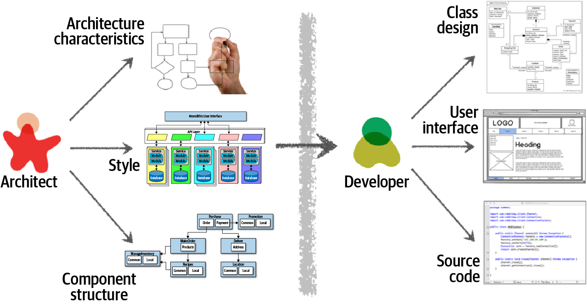

# 第二章 架构的思考

架构师从开发商的角度看待事物是不同的，就像气象学家从艺术家的角度看待云是一样不同的。这就是所谓的架构思维。不幸的是，太多的架构师认为架构思维仅仅是“思考架构”。

架构思维远不止于此。它是用架构的眼光，或架构的观点来看待事物。像架构师一样思考主要有四个方面。首先，理解架构和设计之间的区别，并知道如何与开发团队协作以使架构工作。其次，它是关于在保持一定技术深度的同时拥有广泛的技术知识，允许架构师看到其他人看不到的解决方案和可能性。第三，它与理解、分析和协调各种解决方案和技术之间的权衡有关。最后，要了解业务驱动的重要性，以及它们如何转化为架构关注点。

在本章中，我们将探讨这四个方面的问题：像架构师一样思考，用架构的眼光看待事物。

## 架构与设计

架构和设计之间的区别常常令人困惑。架构在哪里结束，设计在哪里开始？与开发人员相比，架构师的职责是什么？像架构师一样思考，就是要了解架构和设计之间的区别，并了解两者如何紧密结合，形成业务和技术问题的解决方案。

考虑图2-1，它说明了架构师与开发人员的传统职责。如图所示，架构师负责分析业务需求以提取和定义架构特征(“-能力”)，选择适合问题领域的架构模式和风格，以及创建组件(系统的构建块)。从这些活动中创建的工件随后被移交给开发团队，开发团队负责为每个组件创建类图，创建用户界面屏幕，以及开发和测试源代码。

图2-1 传统的架构与设计的观点

图2-1中所示的传统责任模型有几个问题。事实上，这幅图确切地说明了为什么架构很少起作用。具体来说，正是这个单向的箭头穿过了将架构师和开发人员分隔开的虚拟和物理障碍，从而导致了所有与架构相关的问题。架构师做出的决策有时永远不会提交给开发团队，而开发团队做出的改变架构的决策很少会返回给架构师。在这个模型中，架构师与开发团队是分离的，因此，架构很少提供它最初设定要做的事情。

为了使架构工作，必须打破架构师和开发人员之间存在的物理和虚拟障碍，从而在架构师和开发团队之间形成一种强大的双向关系。架构师和开发人员必须在同一个虚拟团队中才能完成这项工作，如图2-2所示。这个模型不仅促进了架构和开发之间的双向沟通，而且还允许架构师为团队中的开发人员提供指导和指导。

图2-2 通过协作使架构工作
与传统的静态和刚性软件架构的瀑布方法不同，今天的系统架构在项目的每个迭代或阶段都会改变和发展。架构师和开发团队之间的紧密合作对于任何软件项目的成功都是必不可少的。那么，架构在哪里结束，设计在哪里开始？它不是。它们都是软件项目生命周期的一部分，为了成功，必须始终保持彼此的同步。

## 技术广度

技术细节的范围在开发人员和架构师之间是不同的。开发人员必须有大量的技术深度才能完成他们的工作，与此不同的是，软件架构师必须有大量的技术广度，才能像架构师一样思考，从架构的角度看待问题。图2-3所示的知识金字塔说明了这一点，它封装了世界上所有的技术知识。事实证明，技术人员应该重视的信息的种类随着职业阶段的不同而不同。

图2-3 金字塔代表着所有的知识
如图2-3所示，任何人都可以把自己的知识分成三个部分：你知道的，你知道你不知道的，和你不知道你不知道的。

您所了解的内容包括技术人员在日常工作中使用的技术、框架、语言和工具，例如作为Java程序员了解Java。你知道你不知道的东西包括那些技术专家知道一点或听说过但很少或没有专业知识的东西。这种知识水平的一个很好的例子就是Clojure编程语言。大多数技术人员都听说过Clojure，并且知道它是一种基于Lisp的编程语言，但是他们不会使用这种语言编写代码。你不知道你不知道的东西是知识三角中最大的一部分，包括所有的技术、工具、框架和语言，它们是技术专家试图解决的问题的完美解决方案，但技术专家甚至不知道这些东西的存在。

开发人员早期的职业生涯专注于扩展金字塔的顶部，以积累经验和专业知识。这是早期的理想关注点，因为开发人员需要更多的视角、工作知识和实践经验。扩大顶部也就是扩大中间部分；当开发人员遇到更多的技术和相关工件时，就会增加他们不知道的东西。

在图2-4中，扩大金字塔的顶部是有益的，因为专业知识很重要。然而，您所知道的东西也是您必须维护的东西——在软件世界中没有什么是静态的。如果一个开发人员成为了Ruby on Rails的专家，那么如果他们忽视Ruby on Rails一两年，这个专家就不会持续下去。金字塔顶端的东西需要时间投资来保持专业技能。归根结底，个人金字塔顶端的大小是他们的技术深度。

图2-4 开发人员必须保持专业知识才能保留它
然而，随着开发人员过渡到架构师角色，知识的性质也发生了变化。架构师的很大一部分价值是对技术的广泛理解，以及如何使用技术解决特定的问题。例如，作为一名架构师，对于一个特定的问题，知道有五个解决方案比只拥有一个专门知识更有益。对于架构师来说，金字塔最重要的部分是顶部和中部；中间部分渗透到底部的深度代表了架构师的技术宽度，如图2-5所示。

图2-5 一个人知道的是技术深度，一个人知道的是技术广度
作为架构师，宽度比深度更重要。因为架构师必须做出与技术约束相匹配的决策，所以对各种各样的解决方案有广泛的了解是很有价值的。因此，对于架构师来说，明智的做法是牺牲一些来之不易的专业知识，并利用这段时间来扩大他们的投资组合，如图2-6所示。正如图中所示，一些专业知识领域将保留下来，可能是在特别令人愉快的技术领域，而其他领域则会萎缩。

图2-6 增强了架构师角色的宽度和收缩深度
我们的知识金字塔说明了架构师和开发人员角色的根本不同。开发人员的整个职业生涯都在磨练他们的专业知识，而过渡到架构师的角色意味着从那个角度的转变，这是许多人觉得困难的。这反过来又导致了两个常见的功能障碍：首先，架构师试图在各种各样的领域中保持专业知识，但在这些领域中都没有成功，并且在这个过程中使自己变得粗糙。第二，它表现为过时的专业知识——一种错误的感觉，认为你过时的信息仍然是前沿的。我们经常在一些大公司中看到这种情况，这些公司的创始人已经成为了领导角色，但仍然使用古老的标准来做技术决策(参见“Frozen Caveman Anti-Pattern”)。

架构师应该关注技术宽度，这样他们就有了一个更大的箭筒。过渡到架构师角色的开发人员可能必须改变他们看待知识获取的方式。平衡关于深度和广度的知识组合是每个开发者在整个职业生涯中都应该考虑的事情。

> 冰冻的穴居人反模式
> 在野外经常观察到的行为反模式，Frozen Caveman反模式，描述了一个架构师总是对每一个架构都回归到他们的宠物非理性关注。例如，Neal的一个同事开发了一个以集中式架构为特色的系统。然而，每次他们将设计交付给客户架构师时，一个挥之不去的问题就是“如果我们失去了意大利怎么办？”几年前，由于通信异常，总部无法与意大利的门店沟通，造成了极大的不便。虽然再次出现的机会非常小，但架构师们已经对这种特殊的架构特征着迷了。
>
> 通常，这种反模式在架构师身上表现出来，这些架构师过去曾因糟糕的决定或意外事件而受到伤害，这使得他们在未来特别谨慎。虽然风险评估很重要，但它也应该是现实的。理解真正的技术风险与感知的技术风险之间的区别是架构师不断学习过程的一部分。像架构师一样思考需要克服这些“冰冻穴居人”的想法和经验，寻找其他解决方案，并提出更相关的问题。

## 分析权衡

像架构师一样思考，就是要看到每个解决方案(技术或其他方面)的权衡，并分析这些权衡，以确定最佳的解决方案是什么。引用马克(你的作者之一)的话：

> 架构是你无法理解的东西。
>

架构中的一切都是一种权衡，这就是为什么宇宙中每个架构问题的著名答案都是“视情况而定”。虽然很多人对这个答案越来越恼火，但不幸的是，这是事实。REST和消息传递哪个更好，或者微服务是否是正确的架构风格，这些都是不确定的。它取决于部署环境、业务驱动、公司文化、预算、时间框架、开发人员技能集和许多其他因素。每个人的环境、处境、问题都不一样，所以架构才这么难。引用Neal(你的另一位作者)的话：

> 在仅针对架构的权衡中没有正确或错误的答案。
>

例如，考虑一个物品拍卖系统，如图2-7所示，在这个系统中，有人为拍卖的物品出价。

图2-7 拍卖系统中权衡队列或主题的例子？
竞价生产者服务生成竞价人的竞价，然后将该竞价金额发送给竞价捕获、竞价跟踪和竞价分析服务。这可以通过使用点对点消息传递方式中的队列或使用发布-订阅消息传递方式中的主题来实现。架构师应该使用哪一种？你不能说出答案。架构思维要求架构师分析与每个选项相关的权衡，并根据具体情况选择最佳方案。

物品拍卖系统的两个消息传递选项如图2-8和2-9所示，图2-8说明了在发布-订阅消息传递模型中主题的使用，图2-9说明了在点对点消息传递模型中队列的使用。

图2-8 使用主题在服务之间进行通信

图2-9 使用队列进行服务之间的通信
图2-8中这个问题的明显优势(和看似明显的解决方案)是架构可扩展性。与图2-9中的队列解决方案不同，Bid Producer服务只需要连接到一个主题，而队列解决方案需要连接到三个不同的队列。如果由于要求为每个竞标者提供他们在每次拍卖中所做的所有投标的历史记录，一个名为“投标历史”的新服务被添加到这个系统中，则根本不需要对现有系统进行任何更改。创建新的Bid History服务时，它可以简单地订阅已经包含投标信息的主题。然而，在图2-9所示的队列选项中，Bid History服务将需要一个新队列，并且Bid Producer将需要修改以向新队列添加一个额外的连接。这里的要点是，在添加新的竞价功能时，使用队列需要对系统进行重大更改，而使用topic方法则不需要对现有的基础设施进行任何更改。另外，注意Bid Producer在topic选项中更加解耦——Bid Producer不知道投标信息将如何使用或被哪些服务使用。在队列选项中，Bid Producer确切地知道如何使用(以及由谁使用)投标信息，因此与系统的耦合程度更高。

通过分析可以清楚地看出，使用发布-订阅消息传递模型的主题方法显然是最好的选择。然而，引用Clojure编程语言的创造者Rich Hickey的话：

程序员知道所有东西的好处和没有东西的利弊。架构师需要了解这两者。

从架构的角度思考是着眼于给定解决方案的优点，但也要分析与解决方案相关的缺点或权衡。继续以拍卖系统为例，软件架构师将分析主题解决方案的缺点。在分析这些差异时，首先要注意图2-8中，对于一个主题，任何人都可以访问投标数据，这可能会带来数据访问和数据安全方面的问题。在图2-9所示的队列模型中，发送到队列的数据只能由接收该消息的特定消费者访问。如果一个流氓服务确实监听了一个队列，那么相应的服务将不会接收到这些出价，并且会立即发送一个关于数据丢失的通知(因此可能存在安全漏洞)。换句话说，窃听一个主题很容易，但窃听队列就不容易了。

除了安全问题，图2-8中的主题解决方案只支持同构契约。所有接收招标数据的服务必须接受同一合同和同一套招标数据。在图2-9中的队列选项中，每个消费者都可以有自己的契约来满足自己的数据需求。例如，假设新的Bid History服务需要当前的报价和报价，但是其他服务不需要这些信息。在这种情况下，需要修改契约，从而影响使用该数据的所有其他服务。在队列模型中，这将是一个单独的通道，因此是一个不影响任何其他服务的单独契约。

图2-8中所示的主题模型的另一个缺点是，它不支持监控主题中的消息数量，因此不支持自动伸缩功能。然而，在图2-9中的队列选项中，每个队列都可以被单独监控，并且编程的负载平衡应用于每个投标消费者，这样每个竞标者都可以独立地自动伸缩。请注意，这种权衡是特定于技术的，因为高级消息队列协议(AMQP)可以支持程序化的负载平衡和监视，因为交换(生产者发送的内容)和队列(消费者侦听的内容)之间是分离的。

考虑到这种权衡分析，现在哪个是更好的选择？答案吗？视情况而定!表2-1总结了这些权衡。

表2-1 权衡为主题

| 主题优势       | 主题劣势               |
| -------------- | ---------------------- |
| 架构的可扩展性 | 数据访问和数据安全问题 |
| 服务解耦       | 没有异构合同           |
|                | 监控和编程可伸缩性     |

这里的要点是，软件架构中的一切都有一个权衡：优点和缺点。像架构师一样分析这些权衡，然后问“哪个更重要：可扩展性还是安全性？”不同解决方案之间的决定总是取决于业务驱动程序、环境和许多其他因素。

## 理解业务驱动因素

像架构师一样思考是理解系统成功所需的业务驱动，并将这些需求转换为架构特征(如可伸缩性、性能和可用性)。这是一项具有挑战性的任务，需要架构师具备一定程度的业务领域知识，并与关键业务涉众保持健康、协作的关系。我们在书中专门用了好几章来讨论这个特定的主题。在第4章中，我们定义了各种架构特征。在第5章中，我们描述了识别和限定架构特征的方法。在第6章中，我们描述了如何度量这些特征，以确保系统的业务需求得到满足。

## 平衡架构和动手编写代码

架构师面临的困难任务之一是如何在编程和软件架构之间取得平衡。我们坚信，每个架构师都应该编写代码，并能够保持一定的技术深度(参见“技术广度”)。虽然这似乎是一个简单的任务，但有时却很难完成。

在实践编码和成为软件架构师之间寻求平衡的第一个技巧是避免瓶颈陷阱。当架构师获得了项目关键路径(通常是底层框架代码)中的代码所有权，并成为团队的瓶颈时，就会出现瓶颈陷阱。这是因为架构师不是全职的开发人员，因此必须在扮演开发人员角色(编写和测试源代码)和架构师角色(绘制图表、参加会议，以及参加更多的会议)之间取得平衡。

作为一名有效的软件架构师，避免瓶颈陷阱的一种方法是将关键路径和框架代码委托给开发团队中的其他人，然后在接下来的一到三次迭代中专注于对业务功能(服务或屏幕)进行编码。这样做会产生三件积极的事情。首先，架构师获得了编写产品代码的实践经验，同时不再成为团队的瓶颈。其次，关键路径和框架代码被分发给开发团队(它属于那里)，使他们拥有所有权，并更好地理解系统中较难的部分。第三，或许也是最重要的一点，架构师正在编写与开发团队相同的与业务相关的源代码，因此能够更好地识别开发团队可能在过程、过程和开发环境方面所经历的痛苦。

但是，假设架构师不能与开发团队一起开发代码。软件架构师如何保持动手操作并保持一定的技术深度？有四种基本的方法可以让架构师在不需要“在家练习编码”的情况下仍然能够亲自动手工作(尽管我们也建议在家里练习编码)。

第一种方法是经常进行概念证明或POCs。这种实践不仅要求架构师编写源代码，而且还通过考虑实现细节来帮助验证架构决策。例如，如果架构师无法在两个缓存解决方案之间做出决定，那么帮助做出决定的一种有效方法是在每个缓存产品中开发一个工作示例，并比较结果。这使得架构师能够看到第一手的实现细节，以及开发完整解决方案所需的工作量。它还允许架构师更好地比较不同缓存解决方案的架构特征，如可伸缩性、性能或总体容错性。

在进行概念验证工作时，我们的建议是，只要有可能，架构师应该尽可能编写最好的产品质量代码。我们推荐这种做法有两个原因。首先，通常情况下，丢弃的概念证明代码会进入源代码存储库，并成为参考架构或其他遵循的指导示例。架构师最不希望看到的就是他们随意丢弃的、草率的代码成为他们典型工作的代表。第二个原因是，通过编写产品质量的概念验证代码，架构师可以获得编写高质量、结构良好的代码的实践，而不是继续开发糟糕的代码实践。

架构师可以亲力亲为的另一种方式是处理一些技术债务故事或架构故事，将开发团队解放出来，以处理关键功能用户故事。这些故事通常是低优先级的，所以如果架构师没有机会在给定的迭代中完成技术债务或架构故事，这不是世界末日，通常不会影响迭代的成功。

类似地，在迭代中修复错误是在帮助开发团队的同时维护实际编码的另一种方式。虽然这种技术并不迷人，但它允许架构师识别出代码库和架构中可能存在的问题和弱点。

通过创建简单的命令行工具和分析器来利用自动化来帮助开发团队完成他们的日常任务，这是在使开发团队更有效的同时保持动手编程技能的另一种好方法。寻找开发团队执行的重复性任务，并使过程自动化。开发团队将感激自动化。一些例子是自动化的源代码验证器，帮助检查在其他lint测试中没有找到的特定编码标准，自动化的检查列表，以及重复的手工代码重构任务。

自动化还可以采用架构分析和适应度功能的形式，以确保架构的生命力和遵从性。例如，架构师可以在Java平台的ArchUnit中编写Java代码，以自动化架构遵从性，或者编写自定义适应函数，以确保架构遵从性，同时获得实际经验。我们将在第6章讨论这些技巧。

作为架构师的最后一项技术是经常进行代码评审。虽然架构师实际上并没有编写代码，但至少他们参与了源代码的编写。此外，进行代码评审还有额外的好处，可以确保与架构的一致性，并在团队中寻找指导和指导的机会。