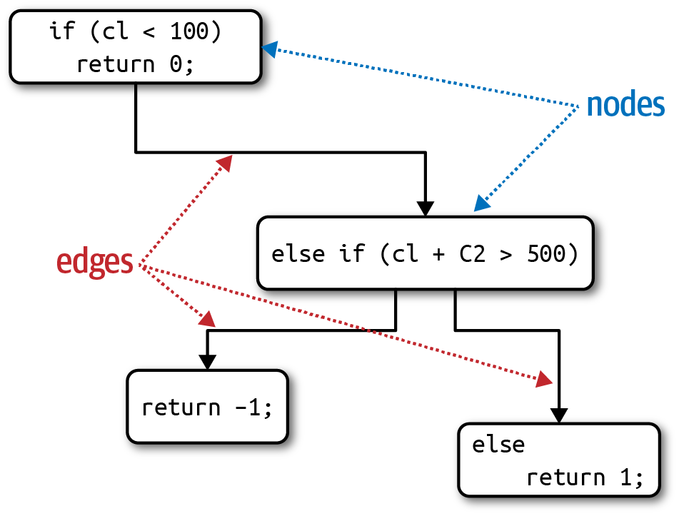
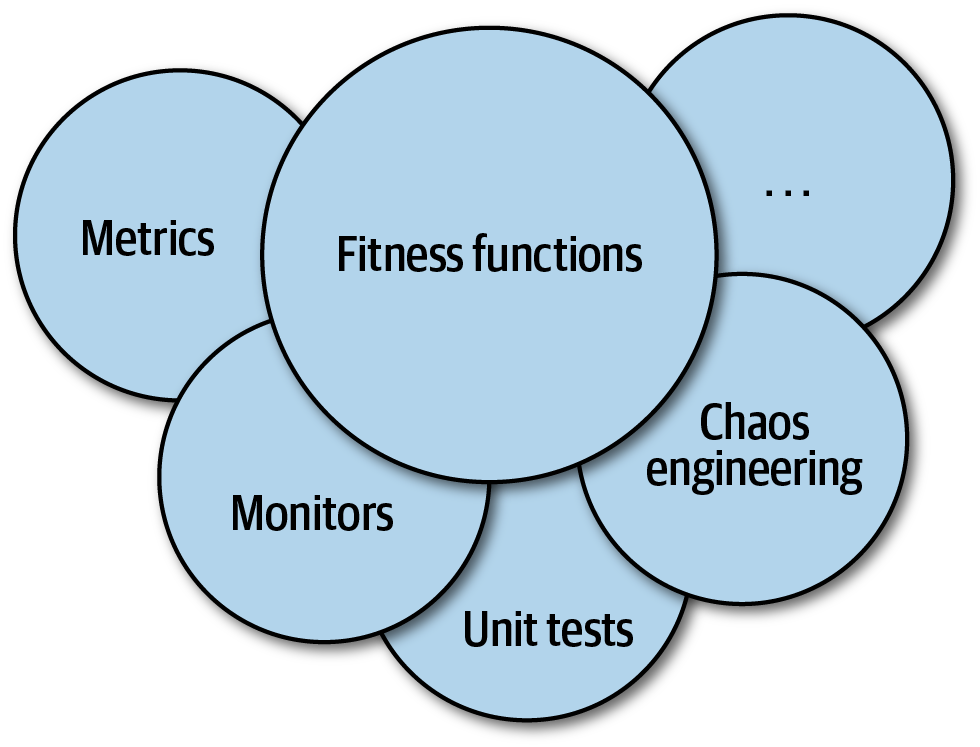
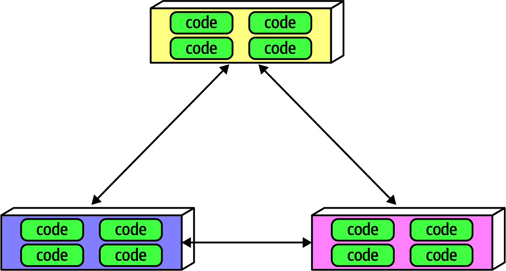
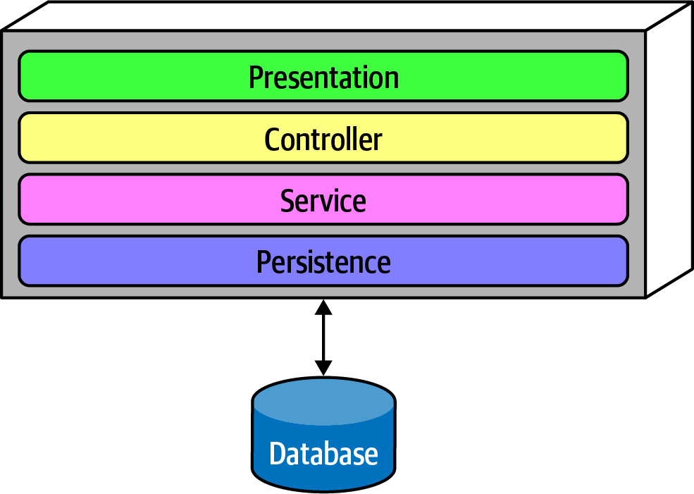

# 第六章 度量和控制架构特征

架构师必须在软件项目的所有不同方面处理非常广泛的架构特征。操作方面(如性能、弹性和可伸缩性)与结构方面(如模块化和可部署性)结合在一起。本章着重于具体定义一些更常见的架构特征，并为它们构建治理机制。

## 测量架构特征

围绕组织架构特征的定义存在几个常见问题:

*他们不是物理*
许多常用的架构特性含义模糊。例如，架构师如何设计敏捷性或可部署性?行业对共同术语的看法大相径庭，有时是出于合理的不同背景，有时是出于偶然。

*变化多端的定义*
即使在同一个组织中，不同的部门可能对关键特性(如性能)的定义存在分歧。除非开发人员、架构和操作人员能够统一在一个通用的定义上，否则很难进行适当的对话。

*太复合*
许多理想的架构特性包含许多较小规模的其他特性。例如，开发人员可以将敏捷性分解为模块化、可部署性和可测试性等特征。

架构特征的目标定义解决了所有三个问题:通过在整个组织范围内对架构特征的具体定义达成一致，团队围绕架构创建了一种普遍存在的语言。此外，通过鼓励客观定义，团队可以分解复合特征，以发现他们可以客观定义的可测量特征。

### 操作措施

许多架构特征具有明显的直接度量，例如性能或可伸缩性。然而，根据团队的目标，这些也提供了许多微妙的解释。例如，团队可能会度量特定请求的平均响应时间，这是一个很好的操作性架构特征度量的例子。但是，如果团队只测量平均值，如果某些边界条件导致1%的请求比其他请求多花10倍的时间，会发生什么呢?如果网站有足够的流量，这些异常值甚至可能不会出现。因此，团队可能还想度量最大响应时间以捕获异常值。

------

#### 表演的多种风格

我们描述的许多架构特征都有多个微妙的定义。性能就是一个很好的例子。许多项目关注的是总体性能:例如，web应用程序的请求和响应周期多长。然而，架构师和DevOps工程师已经在建立性能预算方面做了大量的工作:为应用程序的特定部分制定特定的预算。例如，许多组织研究了用户行为，并确定首页呈现的最佳时间(网页在浏览器或移动设备上的第一个可见的进展迹象)是500ms——半秒;大多数申请都在两位数范围内。但是，对于试图捕获尽可能多的用户的现代站点来说，这是一个重要的跟踪指标，而它们背后的组织已经建立了非常微妙的衡量标准。

其中一些指标对应用程序的设计有额外的含义。许多有远见的组织将K-weight预算用于页面下载:特定页面上允许的库和框架的最大字节数。这种结构背后的原理来自于物理约束:在一个网络中一次只能传输这么多字节，特别是对于处于高延迟区域的移动设备。

------

高水平的团队不只是建立硬性的业绩数据;他们的定义是基于统计分析的。例如，视频流服务希望监控可伸缩性。工程师们不是设定一个任意的数字作为目标，而是随着时间的推移测量规模并建立统计模型，然后在实时指标超出预测模型时发出警报。失败可能意味着两件事：模型是不正确的（这是团队想要知道的），或者有些东西是错误的（这也是团队想要知道的）。

团队现在可以衡量的特征类型正在迅速发展，同时还伴随着工具和微妙的理解。例如，许多团队最近都在关注性能预算指标，如第一次内容绘制和第一次CPU空闲，这两项指标都说明了移动设备上的网页用户的性能问题。随着设备、目标、能力和无数其他事物的变化，团队将发现新的事物和测量方法。

### 构造措施

一些客观的衡量标准不如业绩那么明显。内部结构特征呢，比如定义良好的模块化?不幸的是，内部代码质量的综合度量还不存在。然而，一些度量标准和通用工具确实允许架构师处理代码结构的一些关键方面，尽管是在狭窄的维度上。

代码的一个明显可测量的方面是复杂度，由*圈复杂度*指标定义。

------

圈复杂度
圈复杂度（Cyclomatic Complexity）是一个代码级别的度量，旨在为函数/方法、类或应用程序级别的代码复杂度提供一个对象度量，由Thomas McCabe, Sr.在1976年开发。

它是通过将图论应用到代码中来计算的，特别是决策点，它会导致不同的执行路径。例如，如果一个函数没有决策语句(如`if`语句)，那么`CC = 1`。如果函数只有一个条件，那么`CC = 2`，因为存在两个可能的执行路径。

计算单个函数或方法的CC的公式是$CC=E-N+2$，其中$N$表示节点(代码行)，$E$表示边(可能的决策)。考虑例6-1中显示的类C代码。

例6-1 圈复杂度评估的示例代码

```c
public void decision(int c1, int c2) {
    if (c1 < 100)
        return 0;
    else if (c1 + c2 > 500)
       return 1;
    else
      return -1;
}
```

例6-1的圈复杂度为3 (=3 - 2 + 2);如图6-1所示。



图6-1 决策函数的圈复杂度

圈复杂度公式中出现的数字2表示单个函数/方法的简化。对于对其他方法的扇出调用(在图论中称为连通分量)，更通用的公式是$CC=E-N+2P$，其中$P$表示连通分量的数量。

------

架构师和开发人员普遍认为，过于复杂的代码代表一种代码味道；它实际上损害了代码库的每一个理想特征，包括模块化、可测试性、可部署性等等。然而，如果团队不关注逐渐增长的复杂性，这种复杂性将逐渐主宰代码库。

------

#### 什么是圈复杂度的好值?

在讨论这个主题时，作者遇到的一个常见问题是:什么是$CC$的好阈值?当然，就像软件架构中的所有答案一样:这要视情况而定!它取决于问题域的复杂性。例如，如果您有一个算法复杂的问题，解决方案将产生复杂的函数。架构师需要关注$CC$的一些关键方面:函数复杂是因为问题域还是因为糟糕的编码?或者，代码分区是否很糟糕?换句话说，一个大的方法可以被分解成更小的逻辑块，将工作(和复杂性)分散到更合理的方法中吗?

一般来说，$CC$的行业阈值表明，如果不考虑其他因素(如复杂领域)，低于10的值是可以接受的。我们认为这个阈值非常高，希望代码低于5，这表明代码具有内聚性和良好的分解。Java世界中的一个度量工具Crap4J试图通过评估$CC$和代码覆盖率的组合来确定你的代码有多糟糕;如果$CC$增长到50以上，再多的代码覆盖率也不能挽救代码。Neal遇到过的最可怕的专业工件是一个单一的C函数，它是$CC$超过800的商业软件包的核心!它是一个有4000多行代码的单一函数，包括`GOTO`语句的自由使用(为了避免嵌套很深的循环)。

像测试驱动开发这样的工程实践有偶然的(但积极的)副作用，为给定的问题域平均生成更小、更不复杂的方法。在实践TDD时，开发人员尝试编写一个简单的测试，然后编写最少的代码来通过测试。这种对离散行为和良好测试边界的关注鼓励了表现出低$CC$的良好因子分解、高凝聚力的方法。

------

### 处理措施

一些架构特征与软件开发过程相交叉。例如，敏捷性经常作为一个理想的特性出现。然而，它是一个复合架构特性，架构师可以将其分解为可测试性和可部署性等特性。

可测试性可以通过几乎所有评估测试完整性的平台的代码覆盖工具来衡量。像所有的软件检查一样，它不能取代思考和意图。例如，一个代码库可以有100%的代码覆盖率，但实际上糟糕的断言实不能为代码提供正确性的信心。然而，可测试性显然是一个客观可测量的特征。类似地，团队可以通过各种指标来衡量可部署性:部署的成功与失败的百分比、部署所花费的时间、部署引发的问题/bug，以及许多其他指标。每个团队都有责任达成一套良好的度量方法，为他们的组织捕获有用的数据，包括质量和数量。这些度量中的许多可以归结为团队的优先级和目标。

敏捷性及其相关部分显然与软件开发过程相关。然而，该过程可能会影响架构的结构。例如，如果易于部署和可测试性是优先级，那么架构师就会在架构级别上更加强调良好的模块化和隔离性，这是架构特性驱动结构决策的一个例子。实际上，软件项目范围内的任何东西都可能上升到架构特征的级别，如果它能够满足我们的三个标准，迫使架构师做出设计决策来考虑它。

## 治理和适应度函数

一旦架构师建立了架构特征和优先级，他们如何确保开发人员会尊重这些优先级?模块化是架构中重要但不紧急的方面的一个很好的例子;在许多软件项目中，紧迫性占主导地位，但是架构师仍然需要一种管理机制。

### 管理架构特征

治理，源于希腊词kubernan(引导)，是架构师角色的一项重要职责。顾名思义，架构治理的范围涵盖了架构师(包括像企业架构师这样的角色)想要施加影响的软件开发过程的任何方面。例如，确保组织中的软件质量属于架构治理的范畴，因为它属于架构的范围，而疏忽可能导致灾难性的质量问题。

幸运的是，有越来越复杂的解决方案可以从架构师那里解决这个问题，这是软件开发生态系统中能力增量增长的一个很好的例子。由极限编程催生的软件项目自动化驱动创造了持续的集成，这导致了进一步的操作自动化，我们现在称之为DevOps，一直到架构治理。《构建进化的架构》(Building Evolutionary Architectures, O 'Reilly)一书描述了一系列技术，称为适应度函数，用于自动化架构治理的许多方面。

### 健身功能

《架构进化架构》中的“进化”一词更多地来自进化计算，而不是生物学。其中一名作者丽贝卡·帕森斯(Rebecca Parsons)博士在进化计算领域花了一段时间，包括遗传算法等工具。遗传算法执行并产生一个答案，然后通过进化计算世界中定义的著名技术进行变异。如果开发人员试图设计一种遗传算法来产生一些有益的结果，他们通常希望指导算法，提供一种客观的方法来指示结果的质量。这种指导机制被称为适应度函数:一个用于评估输出距离实现目标有多近的目标函数。例如，假设一个开发人员需要解决旅行销售人员问题，这是一个著名的问题，可以作为机器学习的基础。给一名销售人员一张他们必须访问的城市的清单，以及这些城市之间的距离，最优的路线是什么?如果开发人员设计了一种遗传算法来解决这个问题，一个适应度函数可能会评估路线的长度，因为最短的可能代表最高的成功。另一个适应度函数可能是评估与路径相关的总成本，并试图将成本保持在最低水平。另一种方法可能是评估旅行销售人员离开的时间，并优化以缩短总旅行时间。

进化架构中的实践借用了这个概念来创建一个架构适应度函数:

> 架构适应度函数
> 提供对某些架构特征或架构特征组合的客观完整性评估的任何机制

适应度函数不是供架构师下载的新框架，而是对许多现有工具的新视角。请注意在定义中“任何机制”一词——架构特征的验证技术随特征的变化而变化。适应度函数重叠了许多现有的验证机制，这取决于它们的使用方式:如度量、监视器、单元测试库、混沌工程等等，如图6-2所示。



图6-2 适应度函数的机制

根据架构的特点，可以使用许多不同的工具来实现适应度函数。例如，在“耦合”中，我们引入了允许架构师评估模块化的度量。下面是几个适应度函数的例子，它们测试模块化的各个方面。

### 循环依赖

模块化是大多数架构师所关心的一种隐式架构特征，因为缺乏维护的模块化会损害代码库的结构;因此，架构师应该优先考虑保持良好的模块化。然而，在许多平台上，这些力量与架构师的良好意图背道而驰。例如，在任何流行的Java或.net开发环境中编码时，只要开发人员引用了一个尚未导入的类，IDE就会提供一个对话框，询问开发人员是否愿意自动导入引用。这种情况经常发生，以至于大多数程序员都养成了将自动导入对话框视为反射动作的习惯。然而，任意地在彼此之间导入类或组件会导致模块化的灾难。例如，图6-3说明了架构师希望避免的一个特别有害的反模式。



图6-3 组件之间的循环依赖性

在图6-3中，每个组件都引用了其他组件中的某些内容。拥有这样的组件网络会破坏模块化，因为开发人员不能在不附带其他组件的情况下重用单个组件。当然，如果其他组件耦合到其他组件，那么架构就会越来越倾向于“Big Ball of Mud”反模式。架构师该如何控制这种行为，而无需不断地监视好战的开发人员?代码检查可以帮助开发，但在开发周期中发生的太晚而无法发挥作用。如果架构师允许开发团队在代码评审之前的一个星期内，在代码库中无限制地导入代码，那么代码库中已经发生了严重的破坏。

解决这个问题的方法是编写一个适应度函数来处理循环，如例6-2所示。

**例6 - 2。适应度函数检测组件循环**

```java
public class CycleTest {
    private JDepend jdepend;

    @BeforeEach
    void init() {
	  jdepend = new JDepend();
	  jdepend.addDirectory("/path/to/project/persistence/classes");
	  jdepend.addDirectory("/path/to/project/web/classes");
	  jdepend.addDirectory("/path/to/project/thirdpartyjars");
    }

    @Test
    void testAllPackages() {
	  Collection packages = jdepend.analyze();
	  assertEquals("Cycles exist", false, jdepend.containsCycles());
    }
}
```

在代码中，架构师使用度量工具JDepend来检查包之间的依赖关系。该工具理解Java包的结构，如果存在循环，那么测试就会失败。架构师可以将此测试连接到项目的持续构建中，而不必担心开发人员会偶然引入循环。这是一个很好的适应度函数的例子，它保护了软件开发的重要实践而不是紧急实践：它是架构师的重要关注点，但对日常编码几乎没有影响。

**与主序列适应度函数的距离**
在“耦合”中，我们引入了到主序列的更深奥的距离度量，架构师也可以使用适应度函数来验证它，如例6-3所示。

**例子6 - 3。与主序列适应度函数的距离**

```java
@Test
void AllPackages() {
    double ideal = 0.0;
    double tolerance = 0.5; // project-dependent
    Collection packages = jdepend.analyze();
    Iterator iter = packages.iterator();
    while (iter.hasNext()) {
      JavaPackage p = (JavaPackage)iter.next();
      assertEquals("Distance exceeded: " + p.getName(),
	    ideal, p.distance(), tolerance);
    }
}
```

在代码中，架构师使用JDepend为可接受的值建立一个阈值，如果类超出这个范围，则测试失败。

这既是对架构特征的客观度量的一个例子，也是在设计和实现适应性函数时开发人员和架构师之间协作的重要性的一个例子。这样做的目的不是为了让一群建筑师登上象牙塔，开发开发人员无法理解的深奥的健身功能。

------

##### 提示

架构师必须确保开发人员在将适应度函数强加给他们之前理解它的目的。

------

适应度函数工具的复杂性在过去几年中有所增加，包括一些特殊用途的工具。其中一个工具是ArchUnit，这是一个受JUnit生态系统的启发并使用了JUnit生态系统的几个部分的Java测试框架。ArchUnit提供了各种预定义的治理规则，这些规则被编成单元测试，并允许架构师编写解决模块化问题的特定测试。考虑图6-4所示的分层架构。



图6-4 分层架构
当设计一个如图6-4所示的分层整体时，架构师定义层是有充分理由的(动机、权衡和分层架构的其他方面将在第10章中描述)。然而，架构师如何确保开发人员尊重这些层呢?一些开发人员可能不理解模式的重要性，而另一些开发人员可能采取一种“请求原谅比请求许可更好”的态度，因为一些重要的局部问题(如性能)。但是允许实现者侵蚀架构的原因会损害架构的长期健康。

ArchUnit允许架构师通过适应度函数来解决这个问题，如例6-4所示。

**例6-4 管理层的ArchUnit适应度函数**

```java
layeredArchitecture()
    .layer("Controller").definedBy("..controller..")
    .layer("Service").definedBy("..service..")
    .layer("Persistence").definedBy("..persistence..")

    .whereLayer("Controller").mayNotBeAccessedByAnyLayer()
    .whereLayer("Service").mayOnlyBeAccessedByLayers("Controller")
    .whereLayer("Persistence").mayOnlyBeAccessedByLayers("Service")
```

在例6-4中，架构师定义了层之间的理想关系，并编写了一个验证适应度函数来管理它。

在.net领域还有一个类似的工具NetArchTest，它允许在该平台上进行类似的测试;c#中的层验证出现在例6-5中。

例子6-5 NetArchTest的层依赖关系

```c#
// Classes in the presentation should not directly reference repositories
var result = Types.InCurrentDomain()
    .That()
    .ResideInNamespace("NetArchTest.SampleLibrary.Presentation")
    .ShouldNot()
    .HaveDependencyOn("NetArchTest.SampleLibrary.Data")
    .GetResult()
    .IsSuccessful;
```

另一个关于健身功能的例子是Netflix的《Chaos Monkey》和相应的《Simian Army》。特别是《一致性》、《安全性》和《看门猴子》就是这种方法的例证。一致性猴子允许Netflix架构师定义由猴子在生产中执行的治理规则。例如，如果架构师认为每个服务都应该有效地响应所有RESTful动词，他们就会将该签入构建到从众猴子中。类似地，Security Monkey会检查每个服务是否存在众所周知的安全缺陷，比如不应该激活的端口和配置错误。最后，Janitor Monkey查找没有其他服务路由的实例。Netflix有一个不断发展的架构，因此开发人员经常迁移到较新的服务，而让旧的服务在没有合作者的情况下运行。因为运行在云上的服务需要花钱，所以Janitor Monkey会寻找孤立的服务，并将它们分解出生产。

------

##### 猿类军队的起源

当Netflix决定将其业务转移到亚马逊的云上时，架构师担心他们不再控制运营——如果运营上出现缺陷会发生什么?为了解决这个问题，他们创造了混沌工程，即最初的混沌猴子，以及最终的猿猴军团。《Chaos Monkey》在生产环境中模拟了一般的混乱状态，看看他们的系统能承受多大的混乱。延迟是一些AWS实例的一个问题，因此混沌猴子会模拟高延迟(这是一个问题，他们最终为它创建了一个专门的猴子，延迟猴子)。像模拟整个亚马逊数据中心故障的Chaos Kong这样的工具，帮助Netflix避免了这种实际发生的故障。

------

混沌工程为架构提供了一个有趣的新视角:这不是一个最终会不会崩溃的问题，而是什么时候会。预见到这些损坏并进行测试以防止它们，这使得系统更加健壮。

几年前，阿图尔•加万德(Atul Gawande)出版的《清单宣言》(the Checklist Manifesto)颇具影响力，书中描述了飞行员和外科医生等职业如何使用清单(有时是法律强制要求的)。这并不是因为这些专业人士不了解他们的工作或健忘。相反，当专业人士一遍又一遍地做一项非常详细的工作时，细节很容易被忽略;一个简洁的清单可以形成有效的提醒。这是适应度函数的正确视角——适应度函数不是重量级的治理机制，而是为架构师提供了一种机制来表达重要的架构原则并自动验证它们。开发人员知道他们不应该发布不安全的代码，但是对于忙碌的开发人员来说，这种优先级与数十或数百个其他优先级竞争。特别是像Security Monkey这样的工具，以及一般的健康功能，允许架构师将重要的治理检查编码到架构的底层。