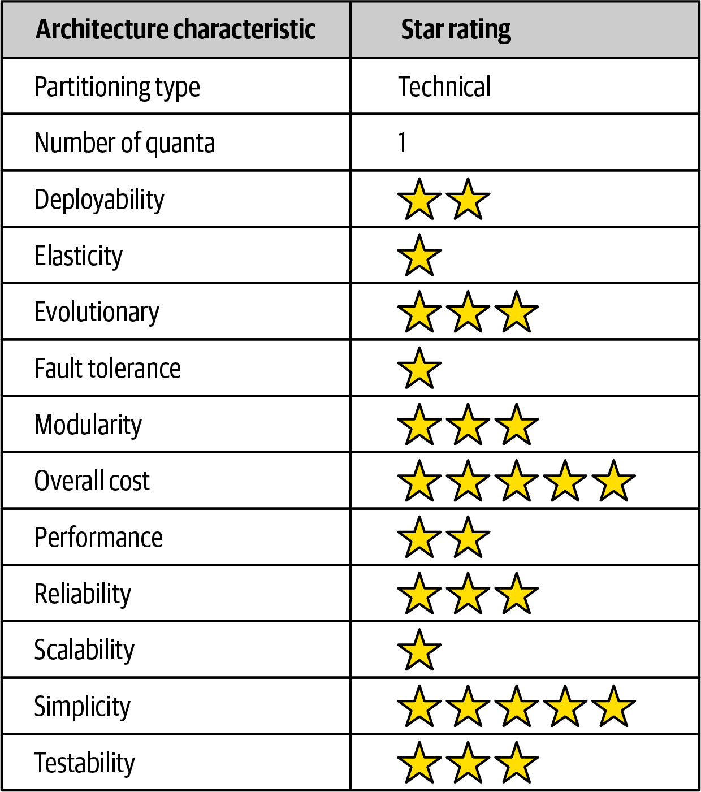

# 第十一章 管道架构风格

管道架构(也称为管道和过滤器架构)是软件架构中反复出现的一种基本风格。一旦开发人员和架构师决定将功能分割成独立的部分，就会遵循这种模式。大多数开发人员都知道这种架构是Unix终端shell语言(如Bash和Zsh)背后的基本原则。

许多函数式编程语言的开发人员将会看到这种体系结构的语言构造和元素之间的相似之处。事实上，许多利用MapReduce编程模型的工具都遵循这个基本拓扑。虽然这些示例展示了管道体系结构样式的底层实现，但它也可以用于更高级别的业务应用程序。

## 拓扑结构

管道架构的拓扑结构由管道和过滤器组成，如图11-1所示。


管道和过滤器以一种特定的方式协调，管道通常以点对点的方式在过滤器之间形成单向通信。

### 管道

这个体系结构中的管道形成了过滤器之间的通信通道。由于性能原因，每个管道通常是单向的、点到点(而不是广播)，接受来自一个源的输入，将输出指向另一个源。管道承载的负载可以是任何数据格式，但架构师倾向于使用少量的数据来实现高性能。

### 过滤器

过滤器是自包含的，独立于其他过滤器，并且通常是无状态的。过滤器应该只执行一个任务。复合任务应该由一系列过滤器而不是单个过滤器来处理。

在这种架构风格中存在四种类型的过滤器:

*生产者*

流程的起点(仅出站)，有时称为源。

*转换器*

接受输入，可选地对部分或全部数据执行转换，然后将其转发到出站管道。功能提倡者将把这一特征视为地图。

*测试人员*

接受输入，测试一个或多个条件，然后根据测试可选地生成输出。函数式程序员将意识到这与reduce很像。

*消费者*

管道流量的终点。使用者有时会将管道过程的最终结果持久化到数据库中，或者在用户界面屏幕上显示最终结果。

每个管道和过滤器的单向性和简单性鼓励了组合重用。许多开发人员在使用shell时发现了这种能力。一个来自博客“多壳少蛋”的著名故事说明了这些抽象是多么的强大。Donald Knuth被要求编写一个程序来解决这个文本处理问题：读取一个文本文件，确定n个最常使用的单词，并打印出这些单词的排序列表及其频率。他用超过10页的Pascal语言编写了一个程序，在这个过程中设计(并记录)了一种新的算法。然后，Doug McIlroy演示了一个shell脚本，该脚本可以轻松地适用于Twitter帖子，更简单、优雅、可理解地解决了这个问题(如果你理解shell命令的话):

```shell
    tr -cs A-Za-z '\n' |
    tr A-Z a-z |
    sort |
    uniq -c |
    sort -rn |
    sed ${1}q
```

即使是Unix shell的设计者也常常对开发人员使用其简单但强大的复合抽象所创造的创造性使用感到惊讶。

## 例子

管道架构模式出现在各种应用程序中，特别是那些简化单向处理的任务。例如，许多电子数据交换(Electronic Data Interchange, EDI)工具使用这种模式，使用管道和过滤器构建从一种文档类型到另一种文档类型的转换。ETL工具(提取、转换和加载)也利用管道体系结构来处理从一个数据库或数据源到另一个数据库或数据源的数据流和修改。协调器和中介(如Apache Camel)利用管道体系结构将信息从业务流程中的一个步骤传递到另一个步骤。

为了说明如何使用管道架构，请考虑以下示例，如图11-2所示，其中各种服务遥测信息通过流从服务发送到Apache Kafka。


图11-3。管道架构示例

注意，在图11-2中，我们使用了管道架构风格来处理流向Kafka的不同类型的数据。服务信息捕获过滤器(生产者过滤器)订阅Kafka主题并接收服务信息。然后，它将捕获的数据发送到一个名为Duration filter的测试过滤器，以确定从Kafka捕获的数据是否与服务请求的持续时间(毫秒)相关。注意过滤器之间关注点的分离；`Service Metrics Capture`过滤器只关心如何连接到Kafka主题并接收流数据，而Duration filter只关心数据的限定和可选的路由到下一个管道。如果数据与服务请求的持续时间(以毫秒为单位)有关，则duration Filter将数据传递给duration Calculator转换器过滤器。否则，它将其传递给Uptime Filter测试器过滤器，以检查数据是否与正常运行时间指标相关。如果不是，则管道结束—数据对这个特定的处理流不感兴趣。否则，如果是正常运行时间指标，则将数据传递给正常运行时间计算器，以计算服务的正常运行时间指标。这些转换器然后将修改后的数据传递给Database Output消费者，后者随后将数据持久化到MongoDB数据库中。

这个例子展示了管道架构的可扩展性。例如，在图11-2中，一个新的测试过滤器可以很容易地添加在Uptime过滤器之后，以将数据传递给另一个新收集的指标，例如数据库连接等待时间。

## 架构特征评级

在图11-3的特征评级表中，一星评级意味着特定的体系结构特征在体系结构中没有得到很好的支持，而五星评级意味着体系结构特征是体系结构风格中最强大的特征之一。记分卡中每个特征的定义可以在第4章中找到。

管道体系结构样式是一种技术上划分的体系结构，因为应用程序逻辑划分为筛选器类型(生产者、测试者、转换器和消费者)。另外，因为管道架构通常是作为单片部署来实现的，所以架构量总是一个。

|架构特征|评分|
|:---|:---|
|分区类型|技术|
|配额数量|1|
|可部署性||
|弹性||
|变更性||
|容错性||
|模块化||
|总体成本||
|性能||
|可部署性||
|可靠性||
|伸缩性||
|简单||
|可测试||



整体成本、简单性和模块化是管道架构风格的主要优势。管道架构本质上是单片式的，不像分布式架构风格那样复杂，管道架构简单易懂，构建和维护成本相对较低。架构模块化是通过分离各种过滤器类型和转换器之间的关注点来实现的。这些过滤器中的任何一个都可以修改或替换，而且不会影响其他滤波器。例如，在Kafka的例子中，如图11-2所示，持续时间计算器可以被修改，以改变持续时间计算而不影响任何其他过滤器。

虽然可部署性和可测试性仅在平均水平左右，但由于通过过滤器实现的模块化级别，其比率略高于分层架构。也就是说，这种架构风格仍然是一个整体，因此，仪式、风险、部署频率和测试的完成仍然影响管道体系结构。

与分层架构类似，这种架构风格的总体可靠性为中等(三颗星)，这主要是由于在大多数分布式架构中缺乏网络流量、带宽和延迟。我们只给了它3颗星的可靠性，因为这种体系结构风格的整体部署的本质，以及可测试性和可部署性问题(例如，必须测试整个整体，并针对任何给定的更改部署整个整体)。

管道架构的弹性和可伸缩性非常低(一星)，主要是因为单片部署。尽管可以在整体规模内实现某些功能，但这种工作通常需要非常复杂的设计技术，如多线程、内部消息传递和其他并行处理实践，而这些技术是该体系结构不太适合的。然而，由于单一的用户界面、后端处理和单一的数据库，管道体系结构总是单一的系统量，因此应用程序只能在单一体系结构量的基础上扩展到某一点。

由于单片部署和缺乏架构模块化，流水线架构不支持容错。如果管道体系结构的一小部分导致内存不足的情况发生，整个应用程序单元都会受到影响并崩溃。此外，由于大多数单体应用程序通常经历较高的平均恢复时间(MTTR)，总体可用性受到影响，对于较小的应用程序，启动时间从2分钟不等，对于大多数大型应用程序，启动时间高达15分钟或更多。
